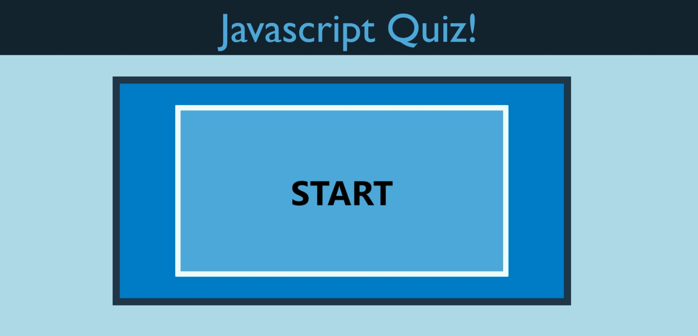

# code_quiz

## Description

The is a quick Javascript/Coding Quiz with just 6 questions to test your proficiency. There is a 60 second timer that will activate once you start the quiz, and you lose 10 seconds for each wrong answer. If you run out of time you will recieve a score of 0. Make sure to get the correct answer to move on to the next question. The quiz will keep track of the highest score in Local Storage and on the final score page. It will also keep track of the scores of all different users. 

## Usage

Here is a screenshot of the beginning of the quiz

Link to the quiz!
<https://sosoberg.github.io/code_quiz/>